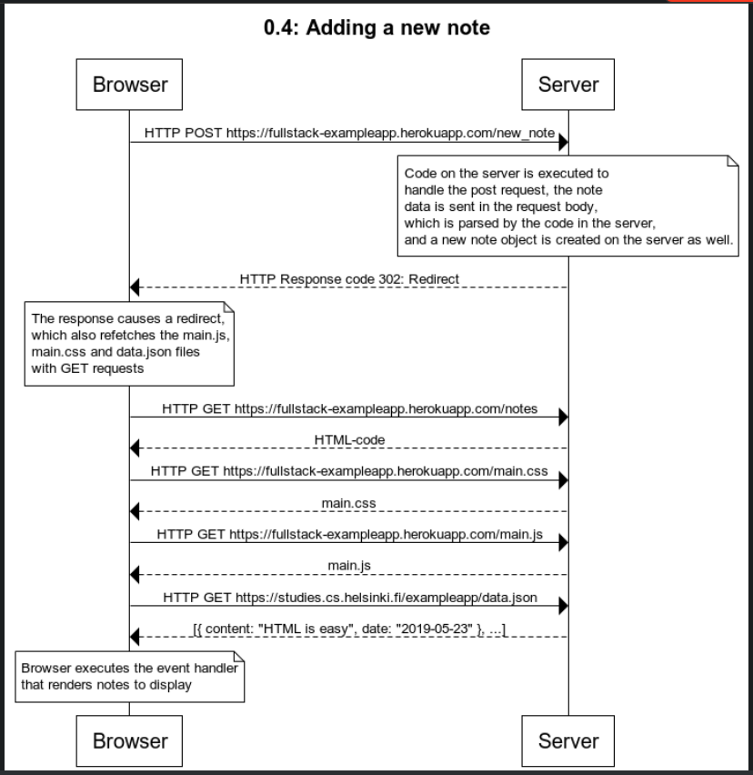

**0.4: Adding a new note**

The code for websequencediagrams

title 0.4: Adding a new note
Browser->Server: HTTP POST https://fullstack-exampleapp.herokuapp.com/new_note
note over Server:
Code on the server is executed to
handle the post request, the note
data is sent in the request body,
which is parsed by the code in the server,
and a new note object is created on the server as well.
end note
Server --> Browser: HTTP Response code 302: Redirect
note over Browser:
The response causes a redirect,
which also refetches the main.js,
main.css and data.json files
with GET requests
end note
Browser -> Server: HTTP GET https://fullstack-exampleapp.herokuapp.com/notes
Server --> Browser: HTML-code
Browser -> Server: HTTP GET https://fullstack-exampleapp.herokuapp.com/main.css
Server --> Browser: main.css
Browser -> Server: HTTP GET https://fullstack-exampleapp.herokuapp.com/main.js
Server --> Browser: main.js
Browser -> Server: HTTP GET https://studies.cs.helsinki.fi/exampleapp/data.json
Server --> Browser: [{ content: "HTML is easy", date: "2019-05-23" }, ...]
note over Browser:
Browser executes the event handler
that renders notes to display
end note

**Screenshot**

