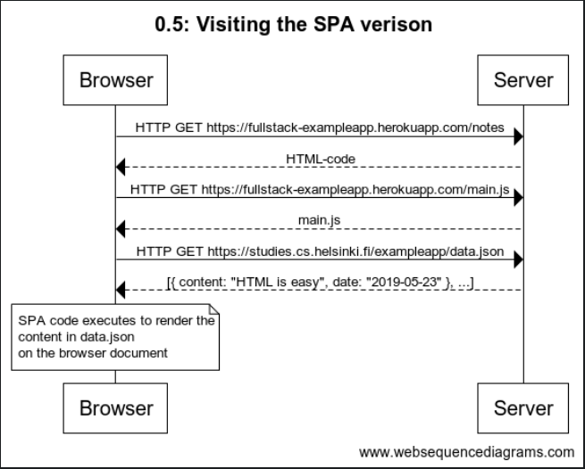

**0.5: Visiting the SPA verison**

The code for websequencediagrams

title 0.5: Visiting the SPA verison

Browser -> Server: HTTP GET https://fullstack-exampleapp.herokuapp.com/notes
Server --> Browser: HTML-code
Browser -> Server: HTTP GET https://fullstack-exampleapp.herokuapp.com/main.js
Server --> Browser: main.js
Browser -> Server: HTTP GET https://studies.cs.helsinki.fi/exampleapp/data.json
Server --> Browser: [{ content: "HTML is easy", date: "2019-05-23" }, ...]
note over Browser:
SPA code executes to render the
content in data.json
on the browser document
end note

**Screenshot**

