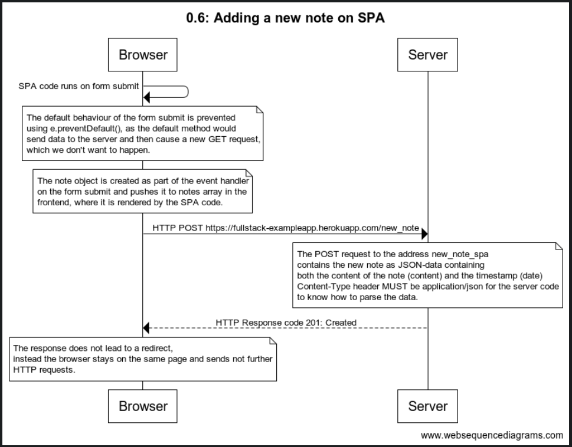

**0.6: Adding a new note on SPA**

The code for websequencediagrams

title 0.6: Adding a new note on SPA

Browser -> Browser: SPA code runs on form submit

note over Browser:
The default behaviour of the form submit is prevented
using e.preventDefault(), as the default method would
send data to the server and then cause a new GET request,
which we don't want to happen.
end note
note over Browser:
The note object is created as part of the event handler
on the form submit and pushes it to notes array in the
frontend, where it is rendered by the SPA code.
end note
Browser->Server: HTTP POST https://fullstack-exampleapp.herokuapp.com/new_note
note over Server:
The POST request to the address new_note_spa
contains the new note as JSON-data containing
both the content of the note (content) and the timestamp (date)
Content-Type header MUST be application/json for the server code
to know how to parse the data.
end note
Server --> Browser: HTTP Response code 201: Created
note over Browser:
The response does not lead to a redirect,
instead the browser stays on the same page and sends not further
HTTP requests.
end note

**Screenshot**

